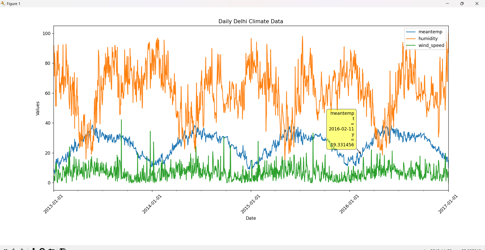

# eda-masters-minor - Daily Climate Data Visualization - Delhi

This repository contains a Python script that reads daily climate data from a CSV file and visualizes it using Matplotlib. The script uses the Pandas library for data manipulation and Matplotlib for plotting.The script generates an interactive web-based visualization of mean temperature, humidity, and wind speed data for Delhi, utilizing the mplcursors and mpld3 libraries for enhanced interactivity.
## Prerequisites

Before running the script, ensure you have the following libraries installed:

- Python (3.6 or higher)
- Pandas
- Matplotlib
- mplcursors
- mpld3

You can install these libraries using the following command:

```bash
pip install pandas matplotlib
pip install mplcursors
pip install mpld3
```

## Usage

1. Clone this repository or download the `readandplot.py` file.

2. Place the CSV file containing the daily climate data in the same directory as the `readandplot.py` file. Make sure the CSV file has the necessary columns: 'date', 'meantemp', 'humidity', 'wind_speed','meanpressure'.

3. Open a terminal or command prompt and navigate to the directory containing the script and the CSV file.

4. Run the script using the following command:

```bash
python readandplot.py
```

The script will read the CSV file, parse the dates, and plot the selected columns over time. The x-axis will show the dates in a customized format for better readability.

## Customization

- To customize the columns to be plotted, modify the `columns_to_plot` list in the script.

- To adjust the date format, update the `DateFormatter` object in the script.

- You can further customize the plot appearance, titles, and labels according to your preferences.

## Code Explanation

The code does the following:

1. Imports necessary libraries for data processing and visualization.
2. Reads climate data from the CSV file and parses the date column.
3. Describes the data and displays data types.
4. Chooses specific columns for plotting (`meantemp`, `humidity`, `wind_speed`).
5. Creates a line plot of the selected columns against the dates.
6. Customizes the date format and rotates x-axis labels for better readability.
7. Adds labels, title, legend, and interactive data labels using `mplcursors`.
8. Converts the plot to an interactive web-based visualization using `mpld3`.
9. Saves the interactive plot as an HTML file.
10. Displays the plot using Matplotlib.

### A detailed explanation can be found below -

**Import all libs needed so far**

``` python
import pandas as pd
import matplotlib.pyplot as plt
import os
from matplotlib.dates
import DateFormatter
import mplcursors import mpld3
```

**Read the data from the file and parse the dates**

```python
# Read the data from the file and parse the dates
d = pd.read_csv('DailyDelhiClimateTrain.csv', sep=',', parse_dates=['date'])
```

**Describe the data**

``` python
# Describe the data
d.describe()
```

**Display the data types**

``` python
# Display the data types
d['date'] = pd.to_datetime(d['date'], format='%Y-%m-%d')
d.info()

# Display the data types
#types = data.dtypes
#print(types)
#typeDate = data['date'].dtypes
#print(typeDate)
#typeTemp = data['meantemp'].dtypes
#print(typeTemp)
#typeHumidity = data['humidity'].dtypes
#print(typeHumidity)
#typeWindSpeed = data['wind_speed'].dtypes
#print(typeWindSpeed)
#typeMeanPressure = data['meanpressure'].dtypes
#print(typeMeanPressure)
```

**Display the first few rows of the data**

``` python
# Display the first few rows of the data
print(d.head())
```

**Choose specific columns for plotting**

``` python
# Choose specific columns for plotting
columns_to_plot = ['meantemp', 'humidity', 'wind_speed']
```

**Plot selected columns**

``` python
# Plot selected columns
fig, ax = plt.subplots()
d.plot(x='date', y=columns_to_plot, ax=ax)
```

**Customize date format**

``` python
# Customize date format
date_format = DateFormatter("%Y-%m-%d") # Example: "2023-08-08"
ax.xaxis.set_major_formatter(date_format)
plt.xticks(rotation=45)
```

**Rotate x-axis labels for better readability**

``` python
# Rotate x-axis labels for better readability
plt.xlabel('Date')
plt.ylabel('Values')
plt.title('Daily Delhi Climate Data')
plt.legend(columns_to_plot)
```

**Make the chart interactive with data labels using mplcursors**

``` python
# Make the chart interactive with data labels using mplcursors
mplcursors.cursor(hover=True)
```

**Convert the plot to an interactive web-based visualization using mpld3**

``` python
# Convert the plot to an interactive web-based visualization using mpld3
interactive_plot = mpld3.fig_to_html(fig)
```

**Save the interactive plot to an HTML file**

```python 
#Save the interactive plot to an HTML file
with open('interactive_plot.html', 'w') as f:
    f.write(interactive_plot)
```

**Display the plot using Matplotlib**

``` python
# Display the plot using Matplotlib.
plt.tight_layout()

plt.show()
```

## Example Output

Below is an example of the plot generated by the script:


---

```bash
    Note - For this the DailyDelhiClimateTrain.csv file was used.
```