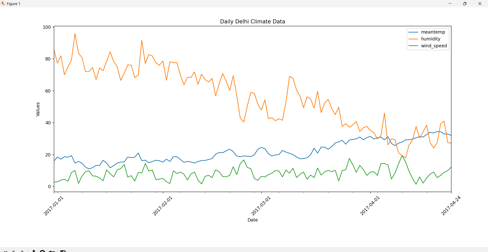

# eda-masters-minor - Daily Climate Data Visualization

This repository contains a Python script that reads daily climate data from a CSV file and visualizes it using Matplotlib. The script uses the Pandas library for data manipulation and Matplotlib for plotting.

## Prerequisites

Before running the script, ensure you have the following libraries installed:

- Pandas
- Matplotlib

You can install these libraries using the following command:

```bash
pip install pandas matplotlib
```

## Usage

1. Clone this repository or download the `readandplot.py` file.

2. Place the CSV file containing the daily climate data in the same directory as the `readandplot.py` file. Make sure the CSV file has the necessary columns: 'date', 'meantemp', 'humidity', 'wind_speed','meanpressure'.

3. Open a terminal or command prompt and navigate to the directory containing the script and the CSV file.

4. Run the script using the following command:

```bash
python readandplot.py
```

The script will read the CSV file, parse the dates, and plot the selected columns over time. The x-axis will show the dates in a customized format for better readability.

## Customization

- To customize the columns to be plotted, modify the `columns_to_plot` list in the script.

- To adjust the date format, update the `DateFormatter` object in the script.

- You can further customize the plot appearance, titles, and labels according to your preferences.

## Example Output

Below is an example of the plot generated by the script:



---

```bash
    Note - For this the DailyDelhiClimateTest.csv file was used.
```
